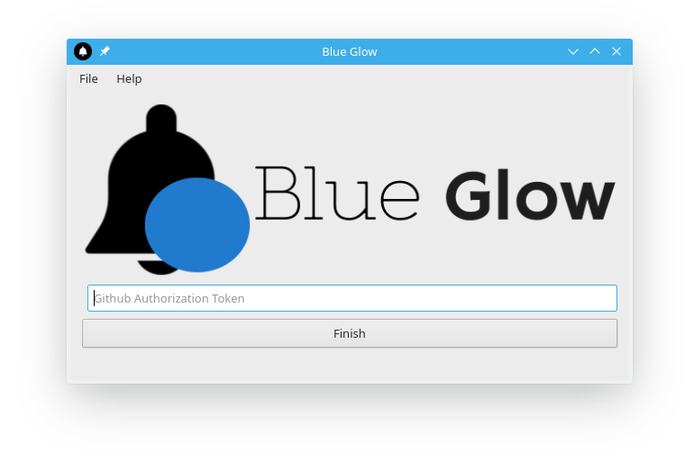
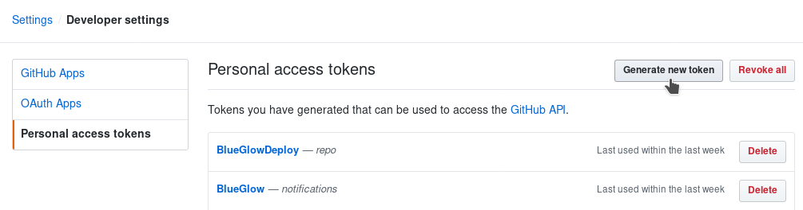
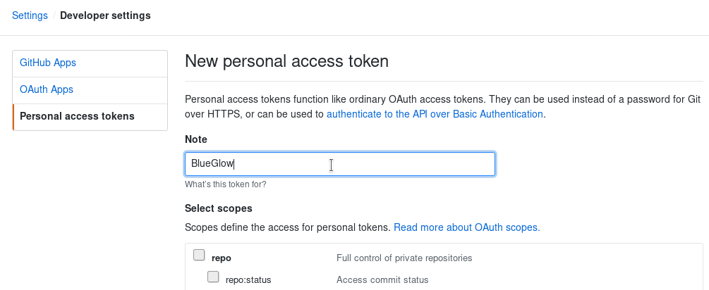
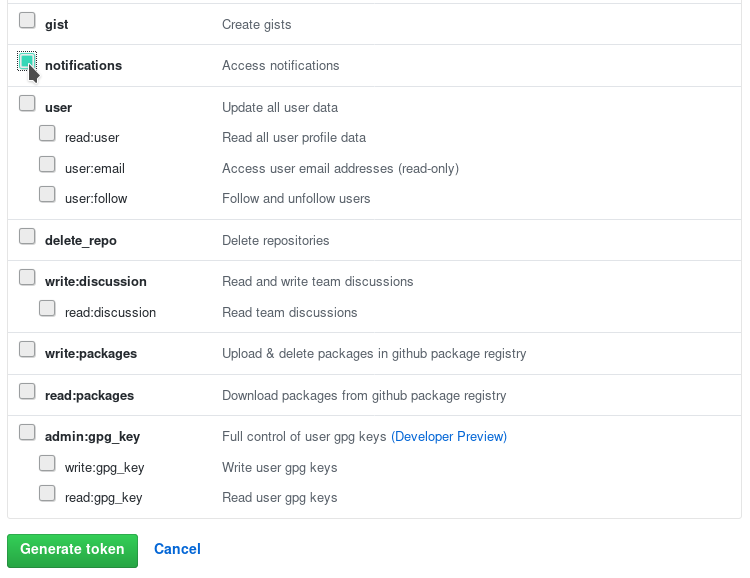
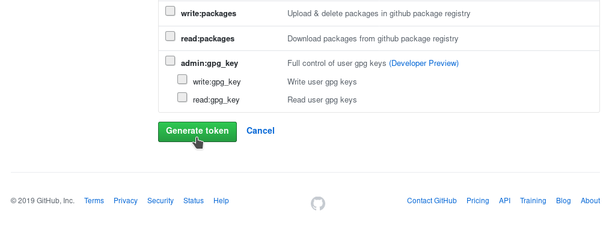

<h1 align="center">Blue Glow</h1>

    
    
    
    
    

<table>
  <tr>
    <th >Download </th>
    <th >Execute</th>
  </tr>
  <tr>
    <td >
    
    </td>
    <td ><b>chmod</b> +x BlueGlow*-x86_64.AppImage &amp;&amp; ./BlueGlow*-x86_64.AppImage </td>
  </tr>
</table>

     

A simple system tray icon program that glows blue and optionally notifies you when you get a github notification.
Only requires a **personal github token** which has a permission to read your notifications. (does not require any other permissions)

# Github Authorization Token Generation

* Head to [https://github.com/settings/tokens](https://github.com/settings/tokens) , click on **'generate new token'** button.

* You will be asked to enter your github password by github. (Make sure to check your url bar)

* Now you can choose any name to give this token just for your sake to remeber why you created it.

* Make sure you enable the checkbox(scope) that says notification , **do not check anything else.**

* Finally click on the **big green generate token** button.

# Other Platform Support

I don't really think that anyone would use this , I mainly created this for myself. So if you need this application for
other platforms other than linux , Then I would be happy to activate automatic builds for Windows and MacOSX.
(PS: The application is mostly cross platform)

# Icons

Icons made by [Chanut](https://www.flaticon.com/authors/chanut) and 
[Pixel-Perfect](https://www.flaticon.com/authors/pixel-perfect) from [www.flaticon.com](https://www.flaticon.com/) is licensed by [CC 3.0 BY](http://creativecommons.org/licenses/by/3.0/)

# License

The MIT License.   
Copyright (C) 2019 , [@antony-jr](https://github.com/antony-jr)
